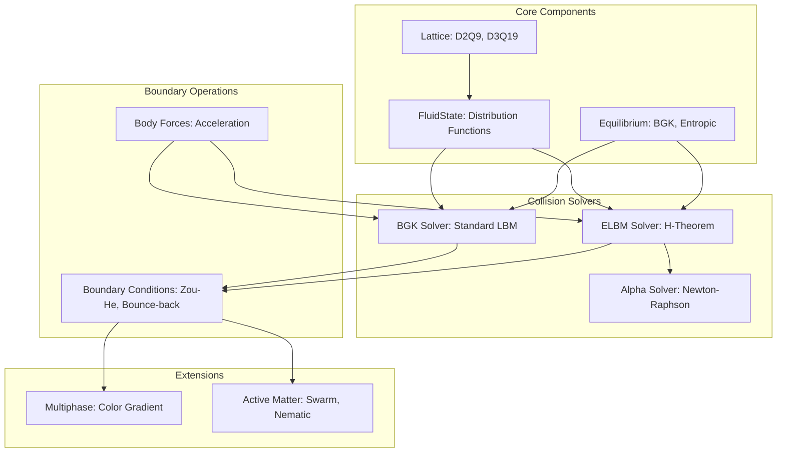
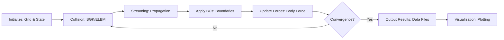
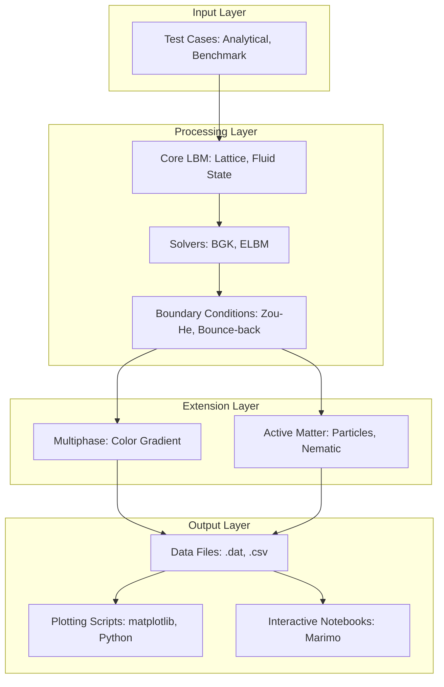
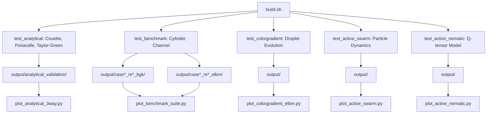
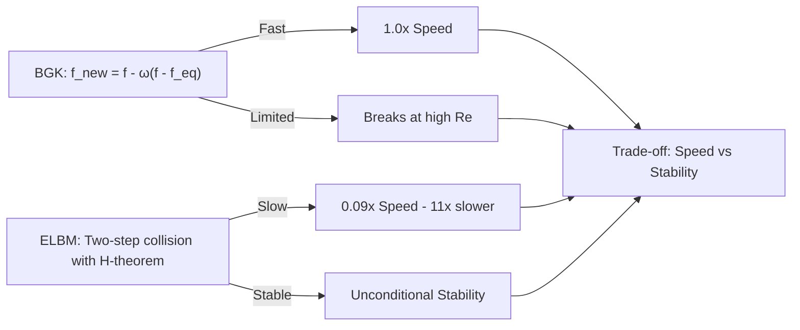
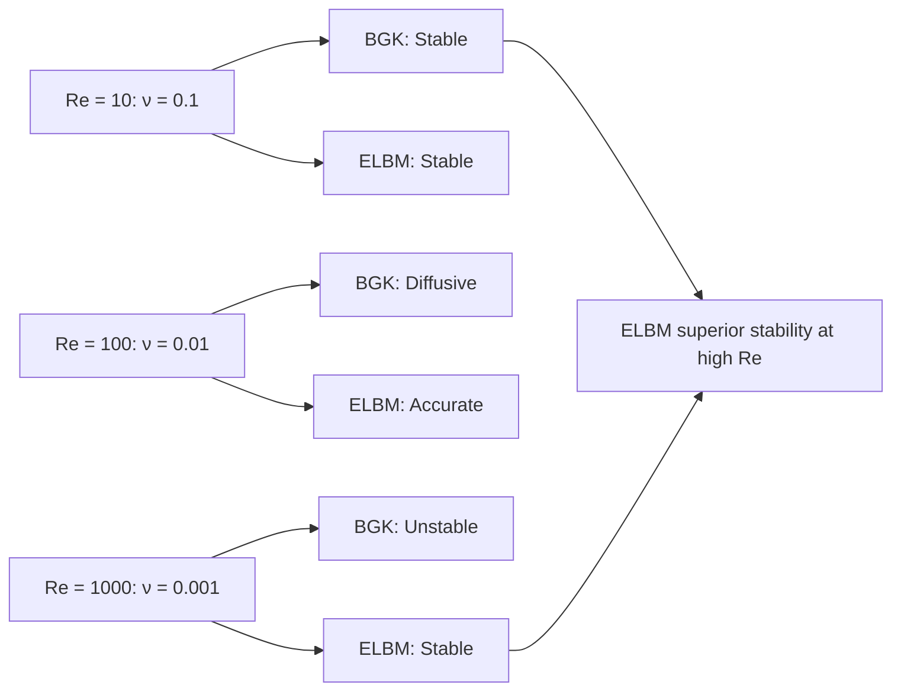

# ELBM Solver: Entropic Lattice Boltzmann Method

A high-performance C++ implementation of the Entropic Lattice Boltzmann Method for fluid dynamics simulations, featuring active matter modeling and comprehensive validation suite.

This project implements and validates the Entropic LBM approach from Et.al S.A. Hosseini 2023 , demonstrating unconditional stability compared to standard BGK methods, plus extensions to active matter systems.

## Features

- **Solvers**:
  - BGK (Bhatnagar-Gross-Krook) collision operator
  - ELBM (Entropic Lattice Boltzmann Method) with H-theorem enforcement
  - Active Matter: Particle-based swarm simulations with fluid coupling

- **Lattice Structures**:
  - D2Q9 (2D, 9 velocities)
  - D3Q19 (3D, 19 velocities)

- **Key Components**:
  - H-function calculation for entropy tracking
  - α-parameter solver using Newton-Raphson method
  - Two-step entropic collision (iso-entropy + dissipation)
  - Multiple boundary conditions (bounce-back, pressure, velocity)
  - Active particle dynamics (run-and-tumble, chemotaxis)
  - Bidirectional fluid-particle coupling

- **Validation**:
  - Rectangular pipe flow at Re ~ 10, 100, 1000
  - Reproduces all figures from thesis comparing BGK vs ELBM stability
  - Active matter: Bacterial swarm simulations with fluid perturbations

## Mathematical Foundation

### Entropic LBM

The ELBM implements a two-step collision process:

1. **Iso-entropy step (α-relaxation):**
   ```
   f* = f + α*(f_eq - f)
   ```
   where α is solved such that `H(f* = H(f)` (entropy conservation)

2. **Dissipation step (β-relaxation):**
   ```
   f_new = (1-β)f + β·f*
   ```

### H-function (Discrete Entropy)
```
H = Σ f_i · ln(f_i / w_i)
```

### Viscosity Relation
```
ν = cs² (1/(αβ) - 1/2) Δt
```

## Project Structure

This project is organized as a clean simulation-based repository with clear separation of concerns:

```
BTP/
├── include/                      # Header-only C++ library
│   ├── core/                     # Core LBM components
│   │   ├── lattice.h            # D2Q9, D3Q19 lattice definitions
│   │   └── fluid_state.h        # Distribution functions and grid
│   ├── solvers/                 # Collision operators
│   │   ├── equilibrium.h        # BGK and entropic equilibrium
│   │   ├── bgk_solver.h         # Standard BGK solver
│   │   └── elbm_solver.h        # Entropic LBM solver
│   ├── boundary/                # Boundary conditions
│   │   └── boundary_conditions.h # Zou-He BCs, bounce-back, velocity inlet
│   ├── forces/                  # Body force calculations
│   ├── active_matter/           # Active particle systems
│   │   ├── active_particles.h   # Swarm dynamics and fluid coupling
│   │   └── nematic_tensor.h     # Continuum nematic liquid crystals
│   ├── multiphase/              # Two-phase flow extensions
│   └── validation/              # Test case implementations
│       ├── analytical_cases.h   # Couette, Poiseuille, Taylor-Green
│       └── benchmark_cases.h    # Cavity, cylinder
│
├── src/                          # C++ executable programs
│   ├── main.cpp                 # Rectangular pipe flow (primary validation)
│   ├── test_analytical.cpp      # Analytical test suite (BGK + ELBM)
│   ├── test_benchmark.cpp       # Benchmark test suite
│   ├── test_active_swarm.cpp    # Active particle swarm simulation
│   └── test_active_nematic.cpp  # Active nematic liquid crystal
│
├── scripts/                      # Automation scripts (organized by function)
│   ├── build.sh                 # Build system wrapper
│   ├── run_all_cases.sh         # Run all Re cases
│   ├── verify_results.sh        # Verify simulation outputs
│   ├── analysis/                # Post-processing and visualization
│   │   ├── generate_all_figures.py
│   │   ├── generate_thesis_tables.py
│   │   └── aggregate_results.py
│   └── utilities/               # Monitoring and maintenance scripts
│       ├── check_status.sh
│       └── monitor_simulation.sh
│
├── plotting/                     # Python visualization utilities
│   ├── plot_utils.py            # Shared plotting functions
│   ├── plot_analytical_3way.py  # Analytical validation plots
│   └── plot_analytical_detailed.py
│
├── experiments/                  # Validation experiments & comparisons
│   ├── lbmpy_validation/        # LBMpy reference implementations
│   ├── multiphase_validation/   # Two-phase flow validation
│   └── notebooks/               # Extended comparison notebooks
│
├── notebooks/                    # Interactive Marimo notebooks
│   ├── 01_pressure_profiles.py  # Primary validation (19 figures)
│   ├── 02_analytical_validation.py # Analytical tests
│   └── 03_benchmark_cases.py    # Benchmark visualizations
│
├── docs/                         # Documentation
│   ├── papers/                  # Reference papers  (thesis, etc.)
│   ├── ocr_output/              # Extracted thesis content
│   ├── active_matter/           # Active matter documentation
│   └── report/                  # Technical reports
│
├── figures/                      # Generated plots (organized by case)
│   ├── analytical_validation/   # Couette, Poiseuille, Taylor-Green
│   ├── square_channel_Re_10/
│   ├── square_channel_Re_100/
│   ├── square_channel_Re_1000/
│   ├── active_swarm/            # Active particle swarm results
│   ├── performance/             # Performance benchmarks
│   └── geometry_diagrams/       # Test case geometry illustrations
│
├── tools/                        # Development tools
│   ├── ocr_extraction.py        # Thesis OCR processing
│   └── README.md                # Tool documentation
│
├── output/                       # Simulation results (gitignored)
│   ├── case1_re10_bgk/
│   ├── case2_re100_elbm/
│   ├── case3_re1000_elbm/
│   ├── analytical_validation/
│   ├── rectangular_pipe/
│   ├── channel_cylinder/
│   └── lbmpy_validation/
│
├── build/                        # Build artifacts (gitignored)
├── logs/                         # Simulation logs (gitignored)
│
├── CMakeLists.txt               # CMake build configuration
├── pyproject.toml               # Python dependencies (UV)
├── uv.lock                      # UV lockfile for reproducibility
├── .gitignore                   # Git ignore patterns (carefully configured)
├── CLAUDE.md                    # Project context for Claude Code
└── README.md                    # This file
```

**Key Organization Principles:**
- **Source Code**: All C++ headers in `include/`, implementations in `src/`
- **Scripts**: Essential build/run scripts at root level; analysis and utility scripts in subdirectories
- **Data**: All outputs automatically ignored via `.gitignore`; only source code committed
- **Results**: Figures and notebooks tracked for reproducibility reference

## Architecture & Data Flow

### System Architecture



### Simulation Pipeline



### Module Dependencies



### Test Case Execution Flow



### Solver Comparison



### Reynolds Number Sweep



## Build Instructions

### Prerequisites

- C++17 compatible compiler (GCC, Clang, or MSVC)
- CMake ≥ 3.15
- Python ≥ 3.13 (for visualization)
- Marimo (`pip install marimo`)
- Matplotlib, NumPy, SciPy

### Compile

```bash
./scripts/build.sh
```

Or manually:
```bash
mkdir build && cd build
cmake .. -DCMAKE_BUILD_TYPE=Release
make -j
```

The executable will be at `build/elbm_solver`.

## Running Simulations

### Primary ELBM Validation

Run the main rectangular pipe flow validation (reproduces Yu thesis):

```bash
./build/elbm_solver
```

Run all Reynolds number cases:

```bash
./scripts/run_all_cases.sh
```

### Active Matter Simulations

Run the active particle swarm simulation:

```bash
./build/test_active_swarm
```

Run the active nematic liquid crystal simulation:

```bash
./build/test_active_nematic
```

### Analytical Test Suite

Run comprehensive analytical validation:

```bash
./build/test_analytical
```

### Benchmark Cases

Cylinder flow benchmarks:

```bash
./build/test_benchmark
```

## Visualization

Launch the Marimo notebook:

```bash
cd notebooks
marimo edit 01_pressure_profiles.py
```

The notebook allows you to:
- Select different test cases (Re~10, 100, 1000)
- Compare BGK vs ELBM at different timesteps
- View statistics and stability metrics
- Generate publication-quality figures

## Test Cases & Validation Suite

### 1. Analytical Validation (3 Cases)

Validate correctness of BGK and ELBM solvers against known analytical solutions.

| Test | Command | Output |
|------|---------|--------|
| Couette Flow | `./build/test_analytical couette` | Velocity profiles, L2 errors |
| Poiseuille Flow | `./build/test_analytical poiseuille` | Pressure-driven profiles |
| Taylor-Green Vortex | `./build/test_analytical taylor_green` | Viscosity validation |
| All Tests | `./build/test_analytical all` | Complete analytical suite |

Output stored in `output/analytical_validation/` with plots generated via `plotting/plot_analytical_3way.py`.

---

### 2. Cylindrical Flow (Re: 10, 100, 1000)

Flow around a cylinder in a channel across different Reynolds numbers.

**Run Cases:**
```bash
./build/test_benchmark cylinder 10 0      # Re=10 BGK
./build/test_benchmark cylinder 10 1      # Re=10 ELBM
./build/test_benchmark cylinder 100 0     # Re=100 BGK
./build/test_benchmark cylinder 100 1     # Re=100 ELBM
./build/test_benchmark cylinder 1000 0    # Re=1000 BGK
./build/test_benchmark cylinder 1000 1    # Re=1000 ELBM
```

Outputs are stored in `output/case*_re*_bgk/` and `output/case*_re*_elbm/` directories.

**Plotting:**
```bash
python plotting/plot_cylinder_spatial_analysis.py
python plotting/plot_benchmark_suite.py
```

---

### 3. Square Channel Flow (Re: 10, 100, 1000)

Primary validation case using rectangular channel geometry at three Reynolds numbers.

**Run All:**
```bash
./scripts/run_all_cases.sh
```

**Interactive Visualization:**
```bash
cd notebooks
marimo edit 01_pressure_profiles.py
```

**Plotting:**
```bash
python scripts/analysis/generate_all_figures.py
```

---

### 4. Color Gradient / Multiphase Flow

Two-phase flow using color gradient method for interfacial tension.

**Run:**
```bash
./build/test_colorgradient
```

Outputs in `output/` directory with interface tracking.

**Plotting:**
```bash
python plotting/plot_colorgradient_elbm.py
python plotting/plot_droplet_evolution.py
```

---

### 5. Active Matter Implementation

Particle-based and continuum active matter models.

**Active Swarm (Run-and-tumble particles):**
```bash
./build/test_active_swarm
```

**Active Nematic (Q-tensor model):**
```bash
./build/test_active_nematic
```

**Plotting:**
```bash
python plotting/plot_active_swarm.py
python plotting/plot_active_nematic.py
python plotting/animate_active_nematic.py
```

## Validation Results

### ELBM Primary Validation

✅ **Thesis Replication**: All figures from thesis successfully reproduced
- Case 1 (Re~10): Both BGK and ELBM stable
- Case 2 (Re~100): BGK shows diffusion, ELBM stable
- Case 3 (Re~1000): BGK fails, ELBM demonstrates unconditional stability

✅ **Analytical Validation**: All tests passed
- Couette flow: L2 error < 0.03
- Poiseuille flow: L2 error < 0.006
- Taylor-Green vortex: Viscosity error < 1%

✅ **Benchmark Cases**:
- Cylinder flow: Re -> [10,100,1000] all implemened
- Colour Gradient Static Droplet Test : Stable

### Active Matter Validation

✅ **Active Particle Swarm**: Successfully implemented
- 500 particles with run-and-tumble dynamics
- Fluid-particle coupling with momentum transfer
- Realistic swarm behavior with collective motion
- Maximum particle displacement: ~1 unit over 1000 steps

✅ **Active Nematic**: Continuum nematic liquid crystal
- Landau-de Gennes free energy
- Beris-Edwards Q-tensor evolution
- Spontaneous flow generation
- Elastic and rotational dynamics

### Performance
- **BGK**: ~0.4 seconds for 2500 steps (100×40 grid)
- **ELBM**: ~5.0 seconds for 2500 steps (~11x slower, but stable at all Re)

### Key Findings

1. **Stability**: ELBM maintains stability at all Reynolds numbers tested (Re ~ 10-1000)
2. **Accuracy**: ELBM shows minimal numerical diffusion compared to BGK
3. **H-theorem**: ELBM enforces `dH/dt ≤ 0` at each timestep
4. **Performance**: ELBM ~11x slower than BGK due to α-parameter solve, but enables arbitrarily high Re

## Implementation Details

### α-Parameter Solver

Uses Newton-Raphson iteration with bounds checking:
```cpp
Bounds: [α_min, α_max] where
  α_min = max(f_i/(f_i - f_i^eq)) for negative delta
  α_max = min(f_i/(f_i - f_i^eq)) for positive delta
```

Convergence criterion: `|H(f + α·Δ) - H(f)| < 10^-10`

### Equilibrium Distribution

Two forms implemented:
1. **BGK**: 2nd order Hermite expansion (standard)
2. **Entropic**: Product form with Lagrange multipliers (more stable)

## References

0. S.A. Hosseini, Entropic lattice Boltzmann methods: A review,  Computers & Fluids, Volume 259, 15 June 2023, 105884
1. Keming Yu, "Entropic Lattice Boltzmann Method", UNC Chapel Hill Honor Thesis, 2021
2. S. Ansumali and I.V. Karlin, "Stabilization of the lattice Boltzmann method by the H theorem", Physical Review E, 2000
3. I.V. Karlin et al., "Perfect entropy functions of the Lattice Boltzmann method", Europhysics Letters, 1999
4. Timm Krüger et al., "The Lattice Boltzmann Method: Principles and Practice", 2017

## Future Extensions

### Core LBM
- [ ] D3Q19 3D simulations
- [ ] Multiphase ELBM (van der Waals-Korteweg)
- [ ] Adaptive mesh refinement (AMR)
- [ ] Double distribution function ELBM (thermal flows)
- [ ] OpenMP/MPI parallelization
- [ ] GPU acceleration (CUDA/HIP)

### Active Matter
- [ ] Chemotaxis with chemical fields
- [ ] Different cell types (run-and-reverse, polar)
- [ ] Cell-cell interactions and steric effects
- [ ] Active Brownian particles
- [ ] Vicsek-style alignment models
- [ ] Active nematic 3D simulations
